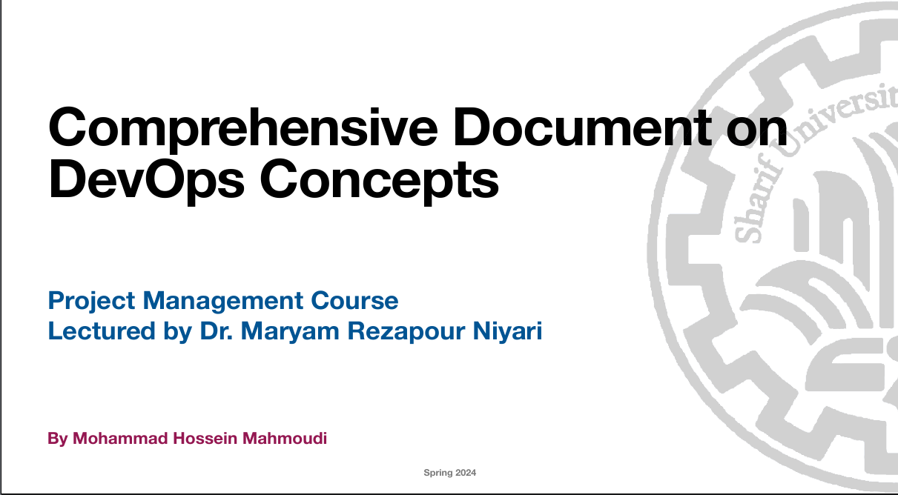

# Introduction to DevOps

This repository contains course materials for the "Introduction to DevOps" course, designed to provide a comprehensive understanding of DevOps principles, practices, and tools. The content is structured to guide beginners through the core concepts of DevOps, including its cultural, technical, and strategic aspects.

## Course Videos

You can access the course videos on Google Drive by clicking the link below:

[DevOps Course Videos](https://drive.google.com/drive/folders/1gVPQ0nVTgeUcIUTi32WLXCrxtU6c-vI0?usp=sharing)

## Course Overview

DevOps is a set of practices that combines software development (Dev) and IT operations (Ops) to shorten the system development life cycle and deliver high-quality software continuously. This course introduces the key principles, cultural shifts, core practices, and tools involved in DevOps. It also explores how DevOps aligns with project management methodologies to enhance software development and deployment.

### Key Topics Covered

1. **Introduction to DevOps**
   - What is DevOps?
   - History and Evolution of DevOps
   - Key Principles of DevOps

2. **The DevOps Culture**
   - Culture Change in DevOps
   - Benefits of DevOps Culture
   - Case Studies

3. **Core Practices and Tools**
   - Continuous Integration and Continuous Delivery (CI/CD)
   - Version Control Systems
   - Configuration Management and Infrastructure as Code
   - Monitoring and Logging

4. **DevOps and Project Management**
   - Agile Project Management
   - Role of a Project Manager in a DevOps Environment
   - DevOps Metrics and KPIs

5. **Implementation Strategies**
   - Starting with DevOps
   - Challenges and Solutions in Adopting DevOps
   - Scaling DevOps

6. **Future Trends in DevOps**
   - Emerging Tools and Technologies
   - DevOps and Cloud Computing
   - Impact of DevOps on Business Strategy

### Course Materials

- **Slides:** A comprehensive set of slides that provide an overview of each topic covered in the course.
- **Documentation:** Detailed documentation covering all the topics, including definitions, principles, best practices, case studies, and FAQs.

## Additional Resources

- **Books:** 
  - *The Phoenix Project* by Gene Kim, Kevin Behr, and George Spafford
  - *The DevOps Handbook* by Gene Kim, Patrick Debois, John Willis, and Jez Humble
  - *Accelerate* by Nicole Forsgren, Jez Humble, and Gene Kim
